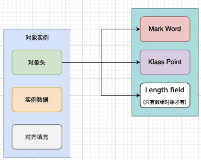

Hotspot 官方文档 对 object header的描述
Common structure at the beginning of every GC-managed heap object. (Every oop points to an object header.) Includes fundamental information about the heap object's layout, type, GC state, `synchronization state`, and `identity hash code`. Consists of `two words`. In arrays it is immediately followed by a length field. Note that both Java objects and VM-internal objects have a common object header format.

Mark Workd(32bit or 64bit)

Klass Pointer(32bit 64bit VM开启指针压缩，pointer会被压缩为 32bit)

HotSpot VM的自动内存管理系统要求对象起始地址必须是8字节的整数倍. 字段内存对齐的其中一个原因，是让字段只出现在同一CPU的缓存行中。 如果字段不是对齐的，那么就有可能出现跨缓存行的字段。也就是说，该字段的读取可能需要替换两个缓存行，而该字段的存储也会同时污染两个缓存行。这两种情况对程序的执行效率而言都是不利的。填充的最终目的是为了计算机高效寻址。

代码在 markOop.cpp
